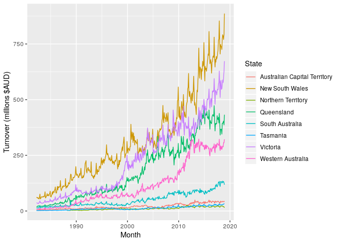
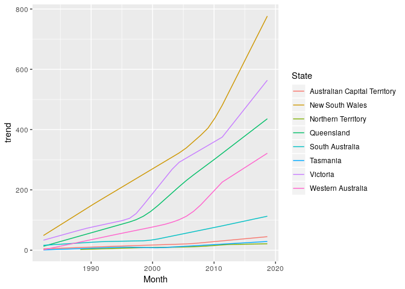
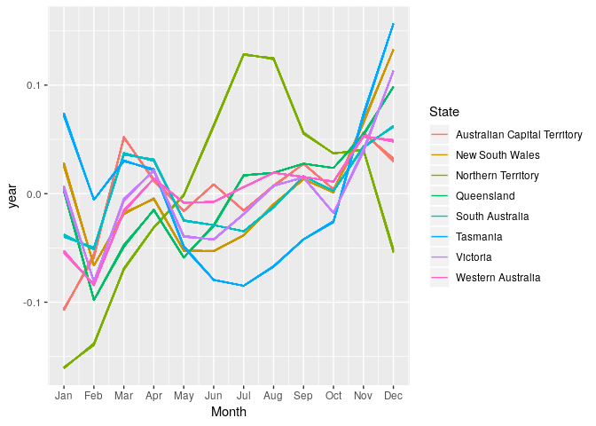
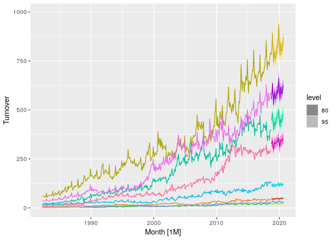

<!-- README.md is generated from README.Rmd. Please edit that file -->

# fable.prophet

[](https://github.com/mitchelloharawild/fable.prophet)
[](https://codecov.io/gh/mitchelloharawild/fable.prophet?branch=master)
[](https://www.tidyverse.org/lifecycle/#experimental)

This package provides a tidy R interface to the prophet forecasting
procedure using [fable](https://github.com/tidyverts/fable). This
package makes use of the [prophet
package](https://cran.r-project.org/package=prophet) for R.

## Installation

The can install the **stable** version from
[CRAN](https://cran.r-project.org/package=fable.prophet):

``` r
install.packages("fable.prophet")
```

You can install the **development** version from
[Github](https://github.com/mitchelloharawild/fable.prophet) with:

``` r
# install.packages("remotes")
remotes::install_github("mitchelloharawild/fable.prophet")
```

## Example

Suppose we wanted to model Australia’s monthly turnover for cafes,
restaurants and catering services. The data is available from the
Australian Bureau of Statistics catalogue 8501.0, and in the
[tsibbledata](https://github.com/tidyverts/tsibbledata) package.

``` r
library(tsibble)
library(dplyr)
cafe <- tsibbledata::aus_retail %>% 
  filter(Industry == "Cafes, restaurants and catering services")
```



Each series generally exhibits an increasing trend with an annual
seasonal pattern that varies proportionally to the level of the series.
At a monthly level, any holiday effects can be modelled using a seasonal
term. A piecewise linear trend is included by default, and so it is not
included in the model specification below.

``` r
library(fable.prophet)
#> Loading required package: Rcpp
#> Loading required package: fabletools
fit <- cafe %>% 
  model(
    prophet = prophet(Turnover ~ season("year", 4, type = "multiplicative"))
  )
```

``` r
fit
#> # A mable: 8 x 3
#> # Key:     State, Industry [8]
#>   State                        Industry                                  prophet
#>   <chr>                        <chr>                                     <model>
#> 1 Australian Capital Territory Cafes, restaurants and catering servic… <prophet>
#> 2 New South Wales              Cafes, restaurants and catering servic… <prophet>
#> 3 Northern Territory           Cafes, restaurants and catering servic… <prophet>
#> 4 Queensland                   Cafes, restaurants and catering servic… <prophet>
#> 5 South Australia              Cafes, restaurants and catering servic… <prophet>
#> 6 Tasmania                     Cafes, restaurants and catering servic… <prophet>
#> 7 Victoria                     Cafes, restaurants and catering servic… <prophet>
#> 8 Western Australia            Cafes, restaurants and catering servic… <prophet>
```

The above output confirms that this Prophet model has been fitted to
each of the time series. Components from this model can be extracted:

``` r
components(fit)
#> # A dable:               3,456 x 10 [1M]
#> # Key:                   State, Industry, .model [8]
#> # Prophet Decomposition: Turnover = trend * (1 + multiplicative_terms) +
#> #   additive_terms + .resid
#>    State Industry .model    Month Turnover additive_terms multiplicative_… trend
#>    <chr> <chr>    <chr>     <mth>    <dbl>          <dbl>            <dbl> <dbl>
#>  1 Aust… Cafes, … proph… 1982 Apr      4.4              0          0.0148   4.44
#>  2 Aust… Cafes, … proph… 1982 May      3.4              0         -0.0132   4.50
#>  3 Aust… Cafes, … proph… 1982 Jun      3.6              0          0.0104   4.57
#>  4 Aust… Cafes, … proph… 1982 Jul      4                0         -0.0132   4.63
#>  5 Aust… Cafes, … proph… 1982 Aug      3.6              0          0.00988  4.69
#>  6 Aust… Cafes, … proph… 1982 Sep      4.2              0          0.0287   4.75
#>  7 Aust… Cafes, … proph… 1982 Oct      4.8              0          0.00126  4.81
#>  8 Aust… Cafes, … proph… 1982 Nov      5.4              0          0.0481   4.87
#>  9 Aust… Cafes, … proph… 1982 Dec      6.9              0          0.0240   4.93
#> 10 Aust… Cafes, … proph… 1983 Jan      3.8              0         -0.106    5.00
#> # … with 3,446 more rows, and 2 more variables: year <dbl>, .resid <dbl>
```



Note that the annual seasonal pattern does not change very quickly,
although it does differ slightly between years. A very differently
seasonal pattern can be seen for the Northern Territory. We can also
produce forecasts for each of these series over the next two years.

``` r
fc <- fit %>% 
  forecast(h = 24)
```

    #> # A fable: 192 x 6 [1M]
    #> # Key:     State, Industry, .model [8]
    #>    State             Industry                 .model    Month     Turnover .mean
    #>    <chr>             <chr>                    <chr>     <mth>       <dist> <dbl>
    #>  1 Australian Capit… Cafes, restaurants and … proph… 2019 Jan sample[1000]  40.2
    #>  2 Australian Capit… Cafes, restaurants and … proph… 2019 Feb sample[1000]  42.9
    #>  3 Australian Capit… Cafes, restaurants and … proph… 2019 Mar sample[1000]  47.9
    #>  4 Australian Capit… Cafes, restaurants and … proph… 2019 Apr sample[1000]  46.2
    #>  5 Australian Capit… Cafes, restaurants and … proph… 2019 May sample[1000]  45.3
    #>  6 Australian Capit… Cafes, restaurants and … proph… 2019 Jun sample[1000]  46.2
    #>  7 Australian Capit… Cafes, restaurants and … proph… 2019 Jul sample[1000]  45.5
    #>  8 Australian Capit… Cafes, restaurants and … proph… 2019 Aug sample[1000]  46.7
    #>  9 Australian Capit… Cafes, restaurants and … proph… 2019 Sep sample[1000]  47.7
    #> 10 Australian Capit… Cafes, restaurants and … proph… 2019 Oct sample[1000]  46.8
    #> # … with 182 more rows


